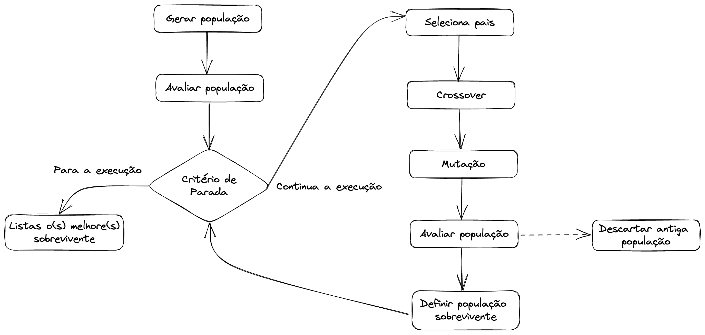

# Algoritmo genético em Python

## 1 Introdução

Os algoritmos genéricos faz do grupo dos algoritmos evolucionários (EA), no qual tem como princípios o processo de evolução natural e a sobrevivência dos mais aptos. 

Neste contexto, os algoritmos genéticos tem como foco principal a evolução a partir das gerações anteriores.

**Fluxo de execução do algoritmo genérico**

## 2 Fluxo de execução do algoritmo genético

## 2.1 Gerar população

Para criar uma população é necessário um conjunto de indivíduos, sendo este representado por um cromossomo ou conter um cromossomo como um dos atributos. Nesta definição o cromossomo representa uma solução.

## 2.2 Avaliar população

A função de avaliação é um medida de qualidade com o intuito de saber como o cromossomo resolve o problema e por consequencia identificar se pode ou não ser utilizado para a evolução.

## 2.3 Critério de parada

O critério de parada define até quando o algoritmo será executado, normalmente é definido uma quantidade de gerações para parar a execução.

## 2.4 Seleção de indivívuos

Na seleção de indivíduos os operadores genéticos são utilizados em indivíduos selecionados dentro da população. Logo, os indivíduos mais mais aptos (função de avaliação maior) serão selecionados com mais frequencia que os menos aptos, caracterizando assim a predominancia dos genes dos melhores indivíduos na nova população. Contudo, privilegiar somente os melhores indivíduos, a população tenderá a ser composta de elemtnos cada vez mais semelhantes, perdendo assim a diversidade das "espécies".

O processo de seleção simula o mecanismo de seleção natural que atua sobre as espécies biológicas, no qual os pais mais aptos geram mais filhoes e os pais menos aptos.

Um dos métodos utilizados para a seleção de indivíduos é o método da roleta viciada, ao qual cada cromossomo recebe um pedaço proporcional a sua avaliação e posteriormente é rodada. 

Outros métodos pode ter como objetivo o elitismo, isto é, preservar a estabilidade dos melhores da população e não sua evolução.

## 2.5 Crossover

O crossover consiste emombinar partes do cromossomo de dois genitores gerando filhos mais aptos e consequentemente com o passar das gerações a população tende a evoluir, normalmente são gerados dois novos filhos.

## 2.6 Mutação

A mutação tem como objetivo criar diversidade, mudando aleatóriamente genes dentro de um indivíduo e é aplicada de forma menos frequente que a reprodução, similar como ocorre na natureza.

## 2.7 

